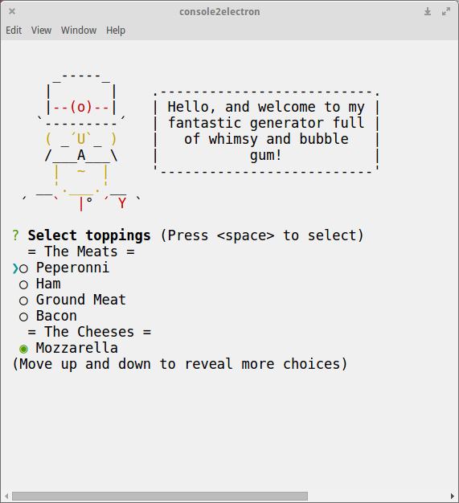

# console2electron



This is an experiment on how to run interactive console node.js modules (inquirer, chalk, yeoman) in [Electron](http://electron.atom.io/).
To achive this I used [term.js](https://github.com/chjj/term.js/) and [child process fork](https://nodejs.org/api/child_process.html).

It is also possible to implement this over http using [socket.io](http://socket.io/) so you can run an interactive yeoman generator on server and use the browser as a terminal client.

Test it:
```
$ npm install
$ npm start
```

